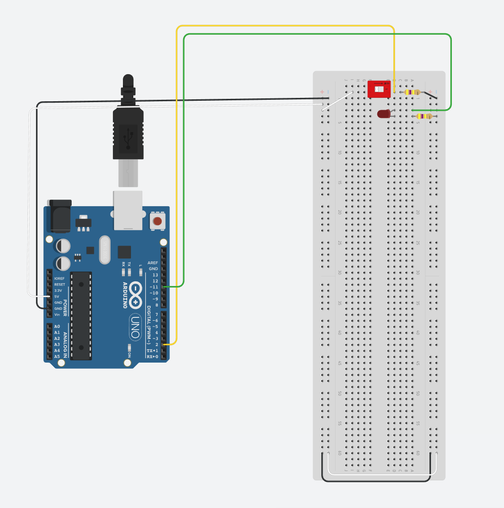

# Lesson 2 - Connect a power switch

## Wire the Arduino to the breadboard
- *Breadboard - the long plastic board with all the holes in it.  This will be use to build a temporary circuit*
- Connect the wires and components as indicated in the diagram
  - *Try to keep the componenets close to one edge of the board.  As we add componenets it will be easier to fit them all in.*
  - *The colors of wires used is not important for the circuit.  It only makes it easier to troubleshoot if you use a consistent theme*
  - *In the diagrams green is output, yellow is input, white is 5v, and black is gnd*



## Arduino basic coding info
- void setup() {}
  - *Used to initialize or setup your program*
  - *Will run only once when the program first starts*
- void loop() {}
  - *Main execution of your code*
  - *Runs over and over again as long as the Arduino has power*


## Create the code for the power switch
- Initialize Global variables
```c
int onSwitch = 2; // Define pin 2 for the switch to listen
int onLED = 11; // Define pin 12 to use for the LED
```
- Define Arduino pins you will be using in setup
```c
void setup() {
  // put your setup code here, to run once:
  pinMode(onSwitch, INPUT); // Have pin 2 listen for input
  pinMode(onLED, OUTPUT); // Use pin 12 for output
}
```
- Build the code to respond to the switch position being changed
```c
void loop() {
  // put your main code here, to run repeatedly:
  // if statement to read if the switch is on of off
  if (digitalRead(onSwitch) == 1) {
    digitalWrite(onLED, HIGH);
  } else {
    digitalWrite(onLED, LOW);
  }
}
```

## Final code should look like this
```c
int onSwitch = 2; // Define pin 2 for the switch to listen on
int onLED = 11; // Define pin 12 to use for the LED

void setup() {
  // put your setup code here, to run once:
  pinMode(onSwitch, INPUT); // Have pin 2 listen for input
  pinMode(onLED, OUTPUT); // Use pin 12 for output
}

void loop() {
  // put your main code here, to run repeatedly:
  // if statement to read if the switch is on of off
  if (digitalRead(onSwitch) == 1) {
    digitalWrite(onLED, HIGH);
  } else {
    digitalWrite(onLED, LOW);
  }
}
```