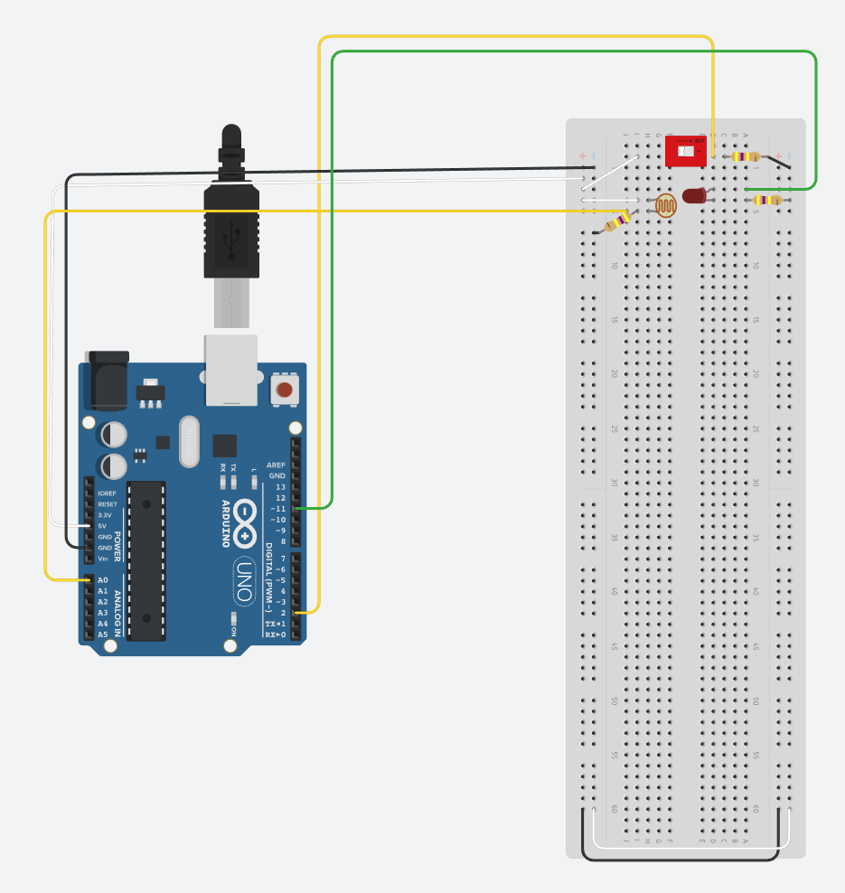

# Lesson 3 - Connect a solar panel

## Expand the circuit created in Lesson 2
- Connect the wires and components as indicated in the diagram
  - *Try to keep the componenets close to one edge of the board.  As we add componenets it will be easier to fit them all in.*
  - *The colors of wires used is not important for the circuit.  It only makes it easier to troubleshoot if you use a consistent theme*
  - *In the diagrams green is output, yellow is input, white is 5v, and black is gnd*



## Create the code for the solar panel
- Add new global variable below the existing ones
```c
int solarPanel = A0; // Define pin A0 for the solar panel
int solarInput = 0; // define solar energy starting point
int batteryLevel = 0; // Set initial battery level at 0
int maxBatteryLevel = 30000; // define when the battery is fully charged
```
- New variable list should look like this
```c
int onSwitch = 2; // Define pin 2 for the switch to listen on
int onLED = 11; // Define pin 12 to use for the LED
int solarPanel = A0; // Define pin A0 for the solar panel
int solarInput = 0; // define solar energy starting point
int batteryLevel = 0; // Set initial battery level at 0
int maxBatteryLevel = 30000; // define when the battery is fully charged
```
- Add new Arduino pins you will be using inside setup
```c
pinMode(solarPanel, INPUT);
Serial.begin(9600);
```
- New setup should look like this
```c
void setup() {
  // put your setup code here, to run once:
  pinMode(onSwitch, INPUT); // Have pin 2 listen for input
  pinMode(onLED, OUTPUT); // Use pin 12 for output
  pinMode(solarPanel, INPUT);
  Serial.begin(9600);
}
```
- Create a new function to charge your battery.  I usually put functions between the setup and the loop but this is not necessary
```c
void solarCharge() {
  solarInput = analogRead(solarPanel);
  if(batteryLevel < maxBatteryLevel) {
    batteryLevel += solarPanel;  
  } else {
    batteryLevel = maxBatteryLevel;
  }
}
```
- Modify your loop to call the solarCharge function and show the charging status
```c
  Serial.print("solarInput: ");
  Serial.println(solarInput);
  Serial.print("batteryLevel: ");
  Serial.println(batteryLevel);
  solarCharge();
```
- New loop should look like this
```c
void loop() {
  // put your main code here, to run repeatedly: 
  Serial.print("solarInput: ");
  Serial.println(solarInput);
  Serial.print("batteryLevel: ");
  Serial.println(batteryLevel);
  solarCharge();
  
  // if statement to read if the switch is on of off
  if (digitalRead(onSwitch) == 1) {
    digitalWrite(onLED, HIGH);
  } else {
    digitalWrite(onLED, LOW);
  }
}
```
## Final code should look like this
```c
int onSwitch = 2; // Define pin 2 for the switch to listen on
int onLED = 11; // Define pin 12 to use for the LED
int solarPanel = A0; // Define pin A0 for the solar panel
int solarInput = 0; // define solar energy starting point
int batteryLevel = 0; // Set initial battery level at 0
int maxBatteryLevel = 30000; // define when the battery is fully charged

void setup() {
  // put your setup code here, to run once:
  pinMode(onSwitch, INPUT); // Have pin 2 listen for input
  pinMode(onLED, OUTPUT); // Use pin 12 for output
  pinMode(solarPanel, INPUT);
  Serial.begin(9600);
}

void solarCharge() {
  // function to read input from solar panel, check to see if battery fully charger, then add to abttery power if not fully charged.
  solarInput = analogRead(solarPanel);
  if(batteryLevel < maxBatteryLevel) {
    batteryLevel += solarPanel;  
  } else {
    batteryLevel = maxBatteryLevel;
  }
}

void loop() {
  // put your main code here, to run repeatedly: 
  Serial.print("solarInput: ");
  Serial.println(solarInput);
  Serial.print("batteryLevel: ");
  Serial.println(batteryLevel);
  solarCharge();
  
  // if statement to read if the switch is on of off
  if (digitalRead(onSwitch) == 1) {
    digitalWrite(onLED, HIGH);
  } else {
    digitalWrite(onLED, LOW);
  }
}
```