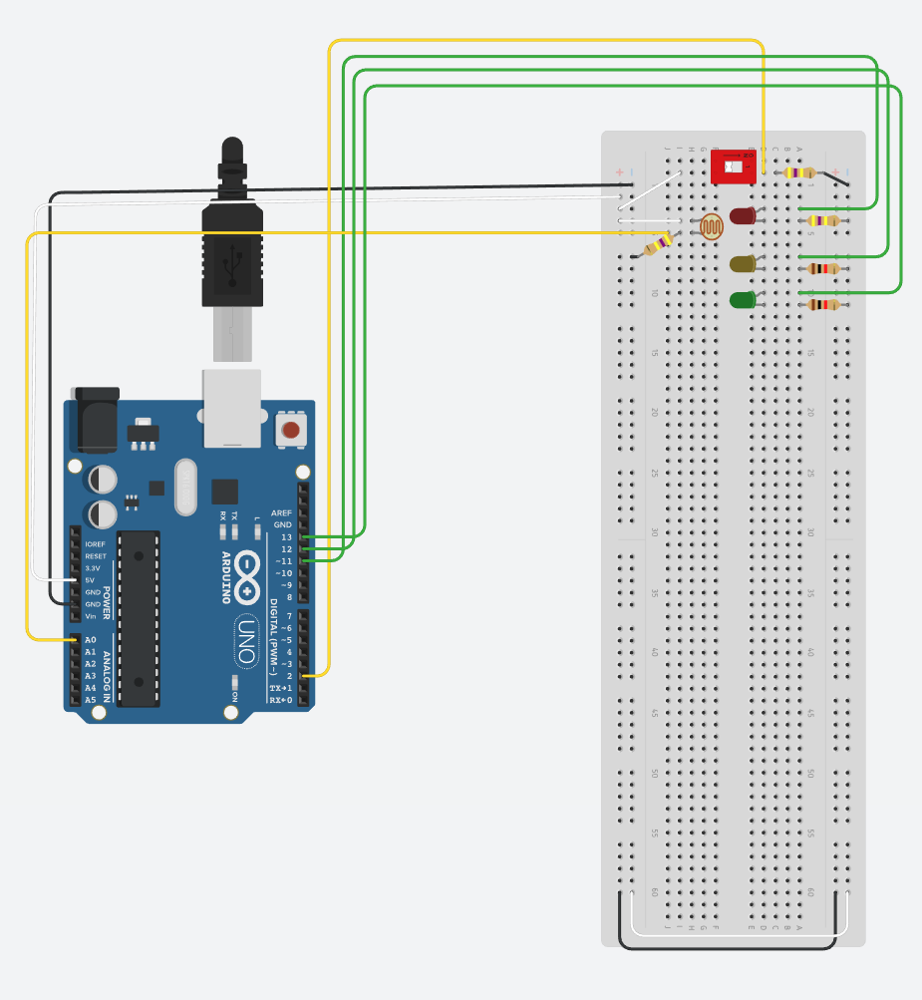

# Lesson 4 - Build a power strip to reflect the battery power

## Expand the circuit created in Lesson 3
- Connect the wires and components as indicated in the diagram
  - *Try to keep the componenets close to one edge of the board.  As we add componenets it will be easier to fit them all in.*
  - *The colors of wires used is not important for the circuit.  It only makes it easier to troubleshoot if you use a consistent theme*
  - *In the diagrams green is output, yellow is input, white is 5v, and black is gnd*



## Create the code for the power strip
- Add new global variable below the existing ones
```c
int redLED = 11; // Define pin 12 to use for the LED
int yellowLED = 12; // Define pin 12 to use for the LED
int greenLED = 13; // Define pin 12 to use for the LED
double batteryPercent = 0;
```
- New variable list should look like this
```c
int onSwitch = 2; // Define pin 2 for the switch to listen on
int redLED = 11; // Define pin 12 to use for the LED
int yellowLED = 12; // Define pin 12 to use for the LED
int greenLED = 13; // Define pin 12 to use for the LED
int solarPanel = A0; // Define pin A0 for the solar panel
int solarInput = 0; // define solar energy starting point
unsigned int batteryLevel = 0;
int maxBatteryLevel = 30000;
double batteryPercent = 0;
```
- Remove Arduino pin that will no longer be used
```c
pinMode(onLED, OUTPUT); // Use pin 12 for output
```
- Add new Arduino pins you will be using inside setup
```c
pinMode(redLED, OUTPUT); // Use pin 12 for output
pinMode(yellowLED, OUTPUT); // Use pin 12 for output
pinMode(greenLED, OUTPUT); // Use pin 12 for output
```
- New setup should look like this
```c
void setup() {
  // put your setup code here, to run once:
  pinMode(onSwitch, INPUT); // Have pin 2 listen for input
  pinMode(redLED, OUTPUT); // Use pin 12 for output
  pinMode(yellowLED, OUTPUT); // Use pin 12 for output
  pinMode(greenLED, OUTPUT); // Use pin 12 for output
  pinMode(solarPanel, INPUT);
  Serial.begin(9600);
}
```
- Create a new function to check the percentage of battery level
```c
double batteryPercentCheck() {
  return ((double)batteryLevel / (double)maxBatteryLevel * 100);
}
```
```
- Create a new function to light the LED that reflects the battery charge
```c
void powerStrip() {
  if (digitalRead(onSwitch) == 1) {
    if (batteryPercent < 25) {
      digitalWrite(redLED, HIGH);
      digitalWrite(yellowLED, LOW);
      digitalWrite(greenLED, LOW);
    } else if (batteryPercent > 25 && batteryPercent < 75) {
      digitalWrite(redLED, LOW);
      digitalWrite(yellowLED, HIGH);
      digitalWrite(greenLED, LOW);
    } else if (batteryPercent > 75 && batteryPercent <= 100) {
      digitalWrite(redLED, LOW);
      digitalWrite(yellowLED, LOW);
      digitalWrite(greenLED, HIGH);
    }
  } else {
    digitalWrite(redLED, LOW);
    digitalWrite(yellowLED, LOW);
    digitalWrite(greenLED, LOW);
  }  
}
```
- Modify your loop to check the battery percentage and light the LED
```c
batteryPercent = batteryPercentCheck();
Serial.print("batteryPercent: ");
Serial.println(batteryPercent);
  
powerStrip();
```
- New loop should look like this
```c
void loop() {
  // put your main code here, to run repeatedly:
  // if statement to read if the switch is on of off
  Serial.print("solarInput: ");
  Serial.println(solarInput);
  Serial.print("batteryLevel: ");
  Serial.println(batteryLevel);
  solarCharge();
  
  batteryPercent = batteryPercentCheck();
  Serial.print("batteryPercent: ");
  Serial.println(batteryPercent);
  
  powerStrip();
}
```
## Final code should look like this
```c
int onSwitch = 2; // Define pin 2 for the switch to listen on
int redLED = 11; // Define pin 12 to use for the LED
int yellowLED = 12; // Define pin 12 to use for the LED
int greenLED = 13; // Define pin 12 to use for the LED
int solarPanel = A0; // Define pin A0 for the solar panel
int solarInput = 0; // define solar energy starting point
unsigned int batteryLevel = 0;
int maxBatteryLevel = 30000;
double batteryPercent = 0;

void setup() {
  // put your setup code here, to run once:
  pinMode(onSwitch, INPUT); // Have pin 2 listen for input
  pinMode(redLED, OUTPUT); // Use pin 12 for output
  pinMode(yellowLED, OUTPUT); // Use pin 12 for output
  pinMode(greenLED, OUTPUT); // Use pin 12 for output
  pinMode(solarPanel, INPUT);
  Serial.begin(9600);
}

void solarCharge() {
  solarInput = analogRead(solarPanel);
  if(batteryLevel < maxBatteryLevel) {
    batteryLevel += solarInput;  
  } else {
    batteryLevel = maxBatteryLevel;
  }
}


double batteryPercentCheck() {
  return ((double)batteryLevel / (double)maxBatteryLevel * 100);
}

void powerStrip() {
  if (digitalRead(onSwitch) == 1) {
    if (batteryPercent < 25) {
      digitalWrite(redLED, HIGH);
      digitalWrite(yellowLED, LOW);
      digitalWrite(greenLED, LOW);
    } else if (batteryPercent > 25 && batteryPercent < 75) {
      digitalWrite(redLED, LOW);
      digitalWrite(yellowLED, HIGH);
      digitalWrite(greenLED, LOW);
    } else if (batteryPercent > 75 && batteryPercent <= 100) {
      digitalWrite(redLED, LOW);
      digitalWrite(yellowLED, LOW);
      digitalWrite(greenLED, HIGH);
    }
  } else {
    digitalWrite(redLED, LOW);
    digitalWrite(yellowLED, LOW);
    digitalWrite(greenLED, LOW);
  }  
}

void loop() {
  // put your main code here, to run repeatedly:
  // if statement to read if the switch is on of off
  Serial.print("solarInput: ");
  Serial.println(solarInput);
  Serial.print("batteryLevel: ");
  Serial.println(batteryLevel);
  solarCharge();
  
  batteryPercent = batteryPercentCheck();
  Serial.print("batteryPercent: ");
  Serial.println(batteryPercent);
  
  powerStrip();
}
```